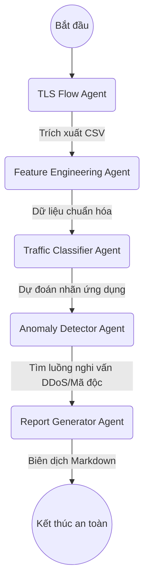

# Orchestration Execution Chain

Đây là biểu đồ luồng nghiệp vụ định tuyến các Agent thực thi theo đúng thứ tự logic của Pipeline phân tích dữ liệu mạng.

```mermaid
graph TD
    Start((Bắt đầu)) --> Agent1(TLS Flow Agent)

    Agent1 -->|Trích xuất CSV| Agent2(Feature Engineering Agent)

    Agent2 -->|Dữ liệu chuẩn hóa| Agent3(Traffic Classifier Agent)

    Agent3 -->|Dự đoán nhãn ứng dụng| Agent4(Anomaly Detector Agent)

    Agent4 -->|Tìm luồng nghi vấn DDoS/Mã độc| Agent5(Report Generator Agent)

    Agent5 -->|Biên dịch Markdown| End((Kết thúc an toàn))
```
