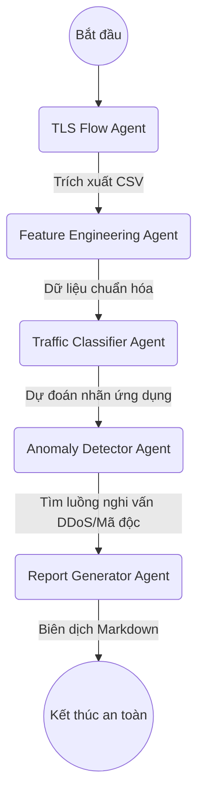

# Orchestration Execution Chain

Đây là biểu đồ luồng nghiệp vụ định tuyến các Agent thực thi theo đúng thứ tự logic của Pipeline phân tích dữ liệu mạng.

## 📋 Cấu hình chi tiết lộ trình Pipeline (Execution Specification)
Bước 1: Trích xuất dòng chảy mạng
Đặc vụ đảm trách: TLS Flow Agent

Kịch bản chỉ thị (Prompt): .pi/prompts/tls_analysis_prompt.md

Kỹ năng liên kết (Skill): tls-analysis

Dữ liệu đầu vào: Thư mục tệp thô datasets/pcap/

Sản phẩm đầu ra: Bảng thuộc tính thô datasets/csv/raw_flows.csv

Bước 2: Tiền xử lý đặc trưng
Đặc vụ đảm trách: Feature Engineering Agent

Kịch bản chỉ thị (Prompt): .pi/prompts/classifier_prompt.md

Kỹ năng liên kết (Skill): feature-processing

Dữ liệu đầu vào: datasets/csv/raw_flows.csv

Sản phẩm đầu ra: Bảng vector số chuẩn hóa datasets/csv/processed_features.csv

Bước 3: Phân loại ứng dụng mã hóa
Đặc vụ đảm trách: Traffic Classifier Agent

Kịch bản chỉ thị (Prompt): .pi/prompts/classifier_prompt.md

Kỹ năng liên kết (Skill): ml-classification

Dữ liệu đầu vào: datasets/csv/processed_features.csv

Sản phẩm đầu ra: Kết quả phân loại datasets/csv/classified_traffic.csv

Bước 4: Phát hiện hành vi bất thường
Đặc vụ đảm trách: Anomaly Detector Agent

Kịch bản chỉ thị (Prompt): .pi/prompts/anomaly_detection_prompt.md

Kỹ năng liên kết (Skill): anomaly-detection

Dữ liệu đầu vào: datasets/csv/classified_traffic.csv

Sản phẩm đầu ra: Kết quả gắn nhãn an ninh datasets/csv/anomaly_detected_traffic.csv

Bước 5: Tổng hợp và Xuất báo cáo
Đặc vụ đảm trách: Report Generator Agent

Kịch bản chỉ thị (Prompt): .pi/prompts/reporting_prompt.md

Kỹ năng liên kết (Skill): reporting

Dữ liệu đầu vào: datasets/csv/anomaly_detected_traffic.csv

Sản phẩm đầu ra: Tệp văn bản tổng hợp outputs/reports/kết_quả.md
